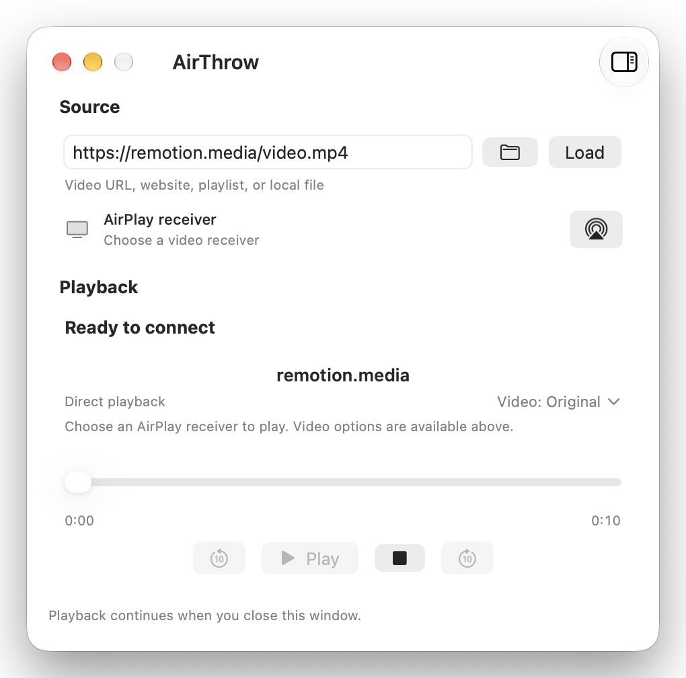

<p align="center">
  
</p>

<h1 align="center">AirThrow</h1>

<p align="center"><strong>Throw anything, AirPlay everything.</strong><sup><a href="#limitations">(*)</a></sup></p>

<p align="center">
  <a href="#installation">Installation</a> ·
  <a href="#build-and-run">Build</a> ·
  <a href="#play-a-video">Usage</a> ·
  <a href="#limitations">Limitations</a>
</p>

AirThrow sends video links and local files to Apple TV and other video-capable
AirPlay receivers. A compact native Mac app controls playback without mirroring
your screen.

<p align="center">
  
</p>

- **Links and files** — direct video URLs, website streams (e.g. Youtube, Twitch), local videos and playlists.
- **Playback options** — video and audio sources, supported subtitles, and optional
  clean up and upscaling to 1080p or 4K.
- **One session** — control playback from the app, menu bar or `athrow` CLI.

## Installation

```bash
brew install --cask marcocosta97/airthrow/airthrow
```

This also installs `yt-dlp`, `deno`, and `ffmpeg`. If macOS blocks the app on
first launch, choose **System Settings → Privacy & Security → Open Anyway**.

## Requirements

- macOS 14 or later.
- Xcode 27 or later, to build the app and its Icon Composer asset.
- Optional: `yt-dlp` for website links, `deno` for YouTube, and `ffmpeg`/
  `ffprobe` for preparation (`brew install ffmpeg yt-dlp deno`).
- The Mac and the receiver must be on the same network.

## Build and run

```bash
bash scripts/build.sh
open build/AirThrow.app
```

This produces a locally signed app, a ZIP archive, and the `build/athrow` CLI.

## Play a video

1. Paste a direct video URL, a website link, or a local file path, or drop a
   file onto the source area, then click **Load**.
2. In **Video options**, choose the source, enhancement and output resolution,
   then close the menu to reload once, paused. Audio and supported subtitles
   can be selected under **Source**.
3. Click the AirPlay button and choose a video-capable receiver, then press
   **Play** when the video and route are ready.

In **Settings → Playback**, enable **Show a waiting screen on the TV** to display
AirThrow on a black background when choosing a receiver before loading a video.

The Mac must stay awake during playback; its display can turn off. To play with
the laptop lid closed, use [Amphetamine](https://apps.apple.com/app/amphetamine/id937984704)
or a similar tool configured to prevent lid-close sleep. AirThrow does not manage
that setting.

## Website links (experimental)

With `yt-dlp`, `deno`, and `ffmpeg` installed, paste a public YouTube watch,
Shorts, `youtu.be`, playlist, or Mix link in the same field. AirThrow finds the
best playable source, preferring one the receiver can play directly. Dedicated
playlist links create a queue of up to 100 items.

Other public video pages use yt-dlp's automatic extractor selection. Playback
depends on the returned media. DRM and media requiring custom request headers
are unsupported.

In **Settings → Cookies**, choose a browser or a Netscape `cookies.txt` file.
Files automatically show recognized services; browser extraction has a services
dropdown. YouTube, Twitch, X, Instagram and Vimeo are supported. Only the loaded
website’s cookies are used; values are never shown or logged. Safari needs Full
Disk Access; Chrome-family browsers may ask for Keychain access. Account access
does not guarantee receiver playback.

## Local files (experimental)

Choose a local video with the folder button, drop it on the source area, or pass
its path to `athrow open`. MP4, M4V, MOV, MKV, and WebM are supported. A
receiver-compatible MP4 or MOV is served in place with no size limit; other
containers may be prepared or converted on the Mac first.

## Limitations

- Playback depends on website, media format and receiver compatibility;
  DRM-protected media is unsupported.
- Enhancements require finite SDR video and never downscale. HDR/Dolby Vision
  processing and surround preservation are unsupported.
- Image-based subtitles, subtitle burn-in and subtitles in Mac-prepared live
  streams are unsupported.

## License

AirThrow's source code is licensed under the [Apache License 2.0](LICENSE).

This license covers AirThrow's own code only. It does not grant rights to
third-party media, to Apple frameworks and services (AVFoundation, AirPlay), or
to external tools such as FFmpeg/ffprobe and yt-dlp, which remain subject to
their own licenses and terms.
